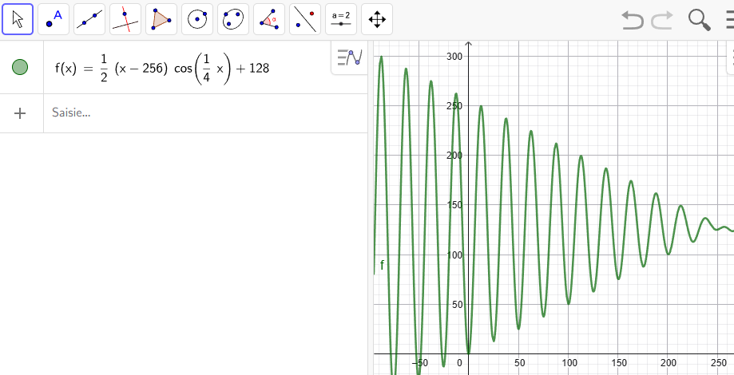

# Jour 10


## Défi

Afficher un carré qui rebondit.

## Démarrer

> A quoi ça sert les maths ???

A faire des animations qui déchirent ! 🤟

On a besoin d'une fonction qui permettent de calculer une ordonnée :

+ qui oscille : une fonction trigonométrique (sin ou cos)

+ qui commence à 0 : on la décale 

+ qui décroit doucement : on multiplie par une fonction décroissante

Après quelques réglages dans GeoGebra, on obtient une fonction qui fait le boulot :



Pour l'améliorer, il faudrait multiplier par une fonction qui décroit comme la fonction inverse...

## Une solution

🐍 [Voir le fichier](day10.py)

```py
import pyxel
from math import cos

pyxel.init(128, 128)

x = 0
y = 0
dy = 0
step = 0

def update() :
    global x, y, dy, step
    
    # Clic-droit pour réinitialiser la séquence
    if pyxel.btnp(pyxel.MOUSE_BUTTON_LEFT) :
        dy = 0
        x = 0

    # On calcule l'ordonnée avec la super-formule
    dy += 1
    y = (dy - 224) / 2 * cos(dy / 3) + 112
    
    # Quand le carré arrive au niveau du sol on l'arrête
    if dy > 220 or y >= 112 :
        y = 112

    # Quand le carré est au sol, on décompte les étapes (~ 10) pour l'animation d'écrasement
    if y == 112 and dy < 220 :
        step += 1
    else :
        step = 0
    
    # On déplace doucement le carré de gauche à droite quand il est en l'air
    if y < 112 and dy < 220 :
        x += 1
    
def draw() :
    global x, y, step
    pyxel.cls(7)
    
    # Le sol
    pyxel.rect(0, 120, 128, 8, 8)
    
    # Le carré
    if step == 0 :
        pyxel.rect(x, y, 8, 8, 9)
        pyxel.line(x, 120, x + 7, 120, 0)
    elif 0 < step <= 3 or 7 < step <= 10 :
        pyxel.rect(x, y + 1, 8, 7, 9)
        pyxel.rect(x - 1, y + 2, 10, 5, 9)
        pyxel.line(x - 1, 120, x + 8, 120, 0)
    elif 3 < step <= 7 :
        pyxel.rect(x, y + 2, 8, 6, 9)
        pyxel.rect(x - 1, y + 3, 10, 4, 9)
        pyxel.rect(x - 2, y + 4, 12, 2, 9)
        pyxel.line(x - 2, 120, x + 9, 120, 0)

pyxel.run(update, draw)
```