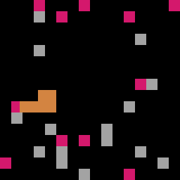

# Jour 14



## Défi

Créer un jeu du serpent (2/3) : ajouter du challenge !

## Démarrer

Ajoutons des pommes déposées aléatoirement sur l'écran et qui font s'allonger le serpent 

⚠️ Ne pas déposer deux pommes au même emplacement !

Ajoutons des rochers déposés aléatoirement sur l'écran et qui seront des obstacles pour le serpent : collision = Game over ! 

⚠️ Ne pas déposer des rochers au même emplacement !

⚠️⚠️ Ne pas déposer des rochers et des pommes au même emplacement !!!

La gestion des collisions peut être faite : 

+   soit en comparant les coordonnées de la têtes et des éléments

+   soit en surveillant la couleur des pixels immédiatement devant la tête (solution choisie ici par simplicité)

## Une solution

🐍 [Voir le fichier](day14.py)

```py
import pyxel
from random import randint

pyxel.init(128, 128)

DIRECTION_NORTH = 0
DIRECTION_EAST = 1
DIRECTION_SOUTH = 2
DIRECTION_WEST = 3

snake : dict
apples : list
rocks : list
gameover : bool
delay : int

def init() :
    global snake, gameover, apples, rocks, delay

    # Création du serpent
    snake = {
        "x" : 64,
        "y" : 64,
        "length" : 0,
        "direction" : DIRECTION_NORTH,
        "previous" : [[64, 64]]
    }

    # Création des pommes
    apples = []
    while len(apples) != 15 :
        apples.append(str(randint(0, 15) * 8) + "," + str(randint(0, 15) * 8))
        # Dédoublonnage des pommes
        apples = list(set(apples))

    # Création des pierres
    rocks = []
    while len(rocks) != 15 :
        rocks.append(str(randint(0, 15) * 8) + "," + str(randint(0, 15) * 8))
        # Dédoublonnage des pierres
        rocks = list(set(rocks))
        # Pas de superposition avec les pommes
        common = (set(rocks)).intersection(set(apples))
        if len(common) > 0 :
            rocks.remove(common.pop())

    # Passage des coordonnées de string en list
    for i in range(len(apples)) :
        apples[i] = list(map(int, apples[i].split(",")))
    for i in range(len(rocks)) :
        rocks[i] = list(map(int, rocks[i].split(",")))

    # Lancement du jeu !
    gameover = False
    delay = pyxel.frame_count

def update() :
    global snake, gameover, apples, rocks
    
    if not gameover : 
        # Sauvegarde de la position
        snake["previous"].append([snake["x"], snake["y"]])
        if len(snake["previous"]) > snake["length"] * 8 :
            snake["previous"].pop(0)

        # Changement de direction (mais pas de demi-tour !)
        if (pyxel.frame_count - delay) % 8 == 0 :
            if snake["direction"] != DIRECTION_SOUTH and pyxel.btn(pyxel.KEY_UP) :
                snake["direction"] = DIRECTION_NORTH
            elif snake["direction"] != DIRECTION_NORTH and pyxel.btn(pyxel.KEY_DOWN) :
                snake["direction"] = DIRECTION_SOUTH
            elif snake["direction"] != DIRECTION_EAST and pyxel.btn(pyxel.KEY_LEFT) :
                snake["direction"] = DIRECTION_WEST
            elif snake["direction"] != DIRECTION_WEST and pyxel.btn(pyxel.KEY_RIGHT) :
                snake["direction"] = DIRECTION_EAST

        # Avancée inexorable
        if snake["direction"] == DIRECTION_EAST :
            snake["x"] += 1
        elif snake["direction"] == DIRECTION_WEST :
            snake["x"] -= 1
        elif snake["direction"] == DIRECTION_NORTH :
            snake["y"] -= 1
        elif snake["direction"] == DIRECTION_SOUTH :
            snake["y"] += 1

        # Colision avec le corps ou une pierre (comparaison de la couleur des pixels devant la tête)
        if snake["direction"] == DIRECTION_EAST and pyxel.pget(snake["x"] + 7, snake["y"]) in [9, 13] :
            gameover = True
        elif snake["direction"] == DIRECTION_WEST and pyxel.pget(snake["x"], snake["y"]) in [9, 13] :
            gameover = True
        elif snake["direction"] == DIRECTION_NORTH and pyxel.pget(snake["x"], snake["y"]) in [9, 13] :
            gameover = True
        elif snake["direction"] == DIRECTION_SOUTH and pyxel.pget(snake["x"], snake["y"] + 7) in [9, 13] :
            gameover = True

        # Manger une pomme
        try : 
            i = apples.index([snake["x"], snake["y"]])
            apples.pop(i)
            snake["length"] += 1
        except ValueError :
            pass
        if len(apples) == 0 :
            gameover = True

        # Gestion des bords de l'écran
        if snake["x"] == -4 :
            snake["x"] = 124
        elif snake["x"] == 124 :
            snake["x"] = -4
        elif snake["y"] == -4 :
            snake["y"] = 124
        elif snake["y"] == 124 :
            snake["y"] = -4
    
    else :
        if (pyxel.btn(pyxel.KEY_RETURN)) :
            init()
            update()

def draw() :
    global snake
    pyxel.cls(0)

    # Affichage des pommes
    for i in range(len(apples)) :
        pyxel.rect(apples[i][0], apples[i][1], 8, 8, 8)

    # Affichage des pierres
    for i in range(len(rocks)) :
        pyxel.rect(rocks[i][0], rocks[i][1], 8, 8, 13)

    # Affichage du serpent
    for i in range(len(snake["previous"])) :
        pyxel.rect(snake["previous"][i][0], snake["previous"][i][1], 8, 8, 9)

    # Game over
    if gameover :
        if len(apples) == 0 :
            pyxel.rect(43, 60, 37, 7, 0)
            pyxel.text(44, 61, "VICTOIRE!", 7)
        else : 
            pyxel.rect(43, 60, 37, 7, 0)
            pyxel.text(44, 61, "GAME OVER", 7)

init()
pyxel.run(update, draw)
```