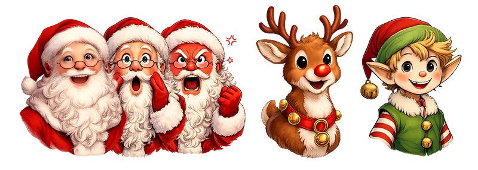

# Jour 19


## Défi

Illustrer une conversation entre le Père Noël, Rudolf et ses lutins à la manière d'un RPG.

## Démarrer

Trois "petites" difficultés :

+   La police par défaut de Pyxel ne contenant pas les caractères accentués français, il faut en trouver une autre... Heureusement d'[autres](https://github.com/IT-Studio-Rech/bdf-fonts) ont fait des recherches pour nous 😄

+   Pour les illustrations, on demande à une IA de nous générer des Pères Noël affichant différentes émotions, un Rudolf et un elfe dans le même style :

    

    Un passage par un éditeur d'images pour les réduire à 50 px de large puis on les glisse dépose dans l'éditeur de ressources Pyxel.

+   Dernière difficulté : on peut coder l'intégralité de la conversation, mais ce ne serait pas digne d'un programmeur ! Il faut donc trouver/inventer une structure de données génériques qui nous permettrait de représenter une conversation avec toutes les infos dont on a besoin :

    + Qui parle ?

    + A qui ?

    + Qu'est-ce qu'il dit ?

    Dans l'ammorce de code ci-dessous, le dictionnaire suivant est utilisé pour décrire chaque phase de la conversation :

    ```py
    {
        "left" : les infos du personnage affiché à gauche (image + nom), 
        "right" : les infos du personnage affiché à droite,
        "text" : le texte à afficher,
        "speaker" : qui parle : left ou right ?
    }
    ```

Voici donc une ammorce de programme pour vous lancer, "il ne reste plus qu'à" coder l'affichage des personnage étape par étape, puis le texte (avec un affichage caractère par caractère, c'est plus classe) et l'enchaînement en appuyant sur Entrée ou espace par exemple.

```py
import pyxel, os

pyxel.init(128, 128)
pyxel.load('../advent.pyxres')

# La police par défaut ne contenant pas les caractères accentués français, on en utilise une autre !
font = pyxel.Font("..\\fonts\\4x6.bdf")

# Coordonnées des images [x, y, u, v, w, h, nom d'affichage] (cf. pyxel.blt())
santa_happy =       [-5, 38,  80,  48, 77, 105, "Père Noël"]
santa_angry =       [-5, 38, 160,  48, 77, 105, "Père Noël"]
santa_surprised =   [-5, 38, 160, 144, 77, 105, "Père Noël"]
rudolf =            [68, 53,   0, 128, 60,  90, "Rudolf"]
elf =               [79, 69,   0,  48, 50,  75, "Skyrgámur"]

# Dictionnaire pour la discussion :
# On prévoit un personnage à gauche (left) et l'autre à droite (right), 
# le texte à lire (text) et un dernier champ désigne celui qui parle pour l'animer (speaker).
discussion = [
    {
        "left" : santa_happy, 
        "right" : None,
        "text" : "RUUUUUUUUUUDOOOOOOOOOOOOOOLF !",
        "speaker" : "left"
    }, 
    {
        "left" : santa_happy, 
        "right" : rudolf,
        "text" : "Ouuuuuuui, patron !",
        "speaker" : "right"
    },
    {
        "left" : santa_happy, 
        "right" : rudolf,
        "text" : "Pourquoi le traîneau n'est-il pas prêt ?",
        "speaker" : "left"
    }, 
    {
        "left" : santa_happy, 
        "right" : rudolf,
        "text" : "Euh...",
        "speaker" : "right"
    }, 
    {
        "left" : santa_happy, 
        "right" : rudolf,
        "text" : "Alors...",
        "speaker" : "right"
    }, 
    {
        "left" : santa_happy, 
        "right" : rudolf,
        "text" : "Comment vous expliquer...?",
        "speaker" : "right"
    }, 
    {
        "left" : santa_angry, 
        "right" : rudolf,
        "text" : "Comment m'expliquer quoi ?",
        "speaker" : "left"
    }, 
    {
        "left" : santa_angry, 
        "right" : rudolf,
        "text" : "Les lutins ont...",
        "speaker" : "right"
    }, 
    {
        "left" : santa_angry, 
        "right" : elf,
        "text" : "Ouais on a \"pimpé\" le traîneau !",
        "speaker" : "right"
    }, 
    {
        "left" : santa_surprised, 
        "right" : elf,
        "text" : "Vous avez quoi ?",
        "speaker" : "left"
    },  
    {
        "left" : santa_surprised, 
        "right" : elf,
        "text" : "On a rabaissé la caisse,",
        "speaker" : "right"
    },  
    {
        "left" : santa_surprised, 
        "right" : elf,
        "text" : "ajouté des réacteurs,",
        "speaker" : "right"
    },  
    {
        "left" : santa_surprised, 
        "right" : elf,
        "text" : "repositionné les ailerons,",
        "speaker" : "right"
    },  
    {
        "left" : santa_surprised, 
        "right" : elf,
        "text" : "mis des phares anti-brouillard au xénon,",
        "speaker" : "right"
    },  
    {
        "left" : santa_surprised, 
        "right" : elf,
        "text" : "installé un mini-frigo...",
        "speaker" : "right"
    },  
    {
        "left" : santa_surprised, 
        "right" : elf,
        "text" : "Un mini-frigo ?",
        "speaker" : "left"
    },  
    {
        "left" : santa_surprised, 
        "right" : elf,
        "text" : "Oui avec des cookies et de la bière au sirop d'érable",
        "speaker" : "right"
    }, 
    {
        "left" : santa_happy, 
        "right" : elf,
        "text" : "Aaaaah ! C'est bien ça !",
        "speaker" : "left"
    }, 
    {
        "left" : santa_happy, 
        "right" : rudolf,
        "text" : "Mais on ne peut plus sortir le traineau du garage !!!",
        "speaker" : "right"
    }, 
    {
        "left" : santa_angry, 
        "right" : None,
        "text" : "Noooooooooooooooooooooooon !!!",
        "speaker" : "left"
    }, 
]

def update() :
    pass

def draw() :
    pass
    
pyxel.run(update, draw)
```

## Une solution

🐍 [Voir le fichier](day19.py)

```py
import pyxel, os

pyxel.init(128, 128)
pyxel.load('../advent.pyxres')

# La police par défaut ne contenant pas les caractères accentués français, on en utilise une autre !
font = pyxel.Font("..\\fonts\\4x6.bdf")

# Coordonnées des images [x, y, u, v, w, h, nom d'affichage] (cf. pyxel.blt())
santa_happy =       [-5, 38,  80,  48, 77, 105, "Père Noël"]
santa_angry =       [-5, 38, 160,  48, 77, 105, "Père Noël"]
santa_surprised =   [-5, 38, 160, 144, 77, 105, "Père Noël"]
rudolf =            [68, 53,   0, 128, 60,  90, "Rudolf"]
elf =               [79, 69,   0,  48, 50,  75, "Skyrgámur"]

# Dictionnaire pour la discussion :
# On prévoit un personnage à gauche (left) et l'autre à droite (right), 
# le texte à lire (text) et un dernier champ désigne celui qui parle pour l'animer (speaker).
discussion = [
    {
        "left" : santa_happy, 
        "right" : None,
        "text" : "RUUUUUUUUUUDOOOOOOOOOOOOOOLF !",
        "speaker" : "left"
    }, 
    {
        "left" : santa_happy, 
        "right" : rudolf,
        "text" : "Ouuuuuuui, patron !",
        "speaker" : "right"
    },
    {
        "left" : santa_happy, 
        "right" : rudolf,
        "text" : "Pourquoi le traîneau n'est-il pas prêt ?",
        "speaker" : "left"
    }, 
    {
        "left" : santa_happy, 
        "right" : rudolf,
        "text" : "Euh...",
        "speaker" : "right"
    }, 
    {
        "left" : santa_happy, 
        "right" : rudolf,
        "text" : "Alors...",
        "speaker" : "right"
    }, 
    {
        "left" : santa_happy, 
        "right" : rudolf,
        "text" : "Comment vous expliquer...?",
        "speaker" : "right"
    }, 
    {
        "left" : santa_angry, 
        "right" : rudolf,
        "text" : "Comment m'expliquer quoi ?",
        "speaker" : "left"
    }, 
    {
        "left" : santa_angry, 
        "right" : rudolf,
        "text" : "Les lutins ont...",
        "speaker" : "right"
    }, 
    {
        "left" : santa_angry, 
        "right" : elf,
        "text" : "Ouais on a \"pimpé\" le traîneau !",
        "speaker" : "right"
    }, 
    {
        "left" : santa_surprised, 
        "right" : elf,
        "text" : "Vous avez quoi ?",
        "speaker" : "left"
    },  
    {
        "left" : santa_surprised, 
        "right" : elf,
        "text" : "On a rabaissé la caisse,",
        "speaker" : "right"
    },  
    {
        "left" : santa_surprised, 
        "right" : elf,
        "text" : "ajouté des réacteurs,",
        "speaker" : "right"
    },  
    {
        "left" : santa_surprised, 
        "right" : elf,
        "text" : "repositionné les ailerons,",
        "speaker" : "right"
    },  
    {
        "left" : santa_surprised, 
        "right" : elf,
        "text" : "mis des phares anti-brouillard au xénon,",
        "speaker" : "right"
    },  
    {
        "left" : santa_surprised, 
        "right" : elf,
        "text" : "installé un mini-frigo...",
        "speaker" : "right"
    },  
    {
        "left" : santa_surprised, 
        "right" : elf,
        "text" : "Un mini-frigo ?",
        "speaker" : "left"
    },  
    {
        "left" : santa_surprised, 
        "right" : elf,
        "text" : "Oui avec des cookies et de la bière au sirop d'érable",
        "speaker" : "right"
    }, 
    {
        "left" : santa_happy, 
        "right" : elf,
        "text" : "Aaaaah ! C'est bien ça !",
        "speaker" : "left"
    }, 
    {
        "left" : santa_happy, 
        "right" : rudolf,
        "text" : "Mais on ne peut plus sortir le traineau du garage !!!",
        "speaker" : "right"
    }, 
    {
        "left" : santa_angry, 
        "right" : None,
        "text" : "Noooooooooooooooooooooooon !!!",
        "speaker" : "left"
    }, 
]

# Une variable pour savoir à quelle étape de la discussion on est arrivé.
discussionStep = 0

# Une variable pour afficher le texte caractère par caractère
textStep = 0

# Ue variable pour animer un petit triangle qui va indiquer qu'on attend une action de l'utilisateur
nextStep = -1

# On ne va pas demander au (brillant) scénariste de découper ses phrases pour qu'elles s'affichent correctement à l'écran
# La fonction justifyContent est là pour ça !
def justifyContent(text : str) -> str :
    # 30 caractères max dans l'encart
    if len(text) > 30 :
        # On compte les mots
        words = text.split(" ")
        # S'il y en a qu'un, on coupe comme des cochons
        if len(words) == 1 :
            text = text[:30] + "-\n" + text[30:]
        # sinon on compte mots par mots
        else :
            text = ""
            letters = 0
            for word in words :
                if letters + len(word) < 30 :
                    text += word + " "
                    letters += len(word) + 1
                else :
                    text += "\n" + word + " "
                    letters = len(word) + 1
    return text

def update() :
    global santa, rudolf, elf, discussion, discussionStep, textStep, nextStep, font
    
    if pyxel.frame_count % 2 == 0 :
    
        # Affichage caractère par caractère
        if textStep < len(discussion[discussionStep]["text"]) :
            textStep += 1

    if pyxel.frame_count % 3 == 0 :

        # Petit triangle qui tourne sur lui-même
        if nextStep > -1 :
            nextStep += 1
            if nextStep > 3 :
                nextStep = 0

        # Le texte est affiché complètement, on lance l'animation du petit triangle
        if nextStep == -1 and textStep == len(discussion[discussionStep]["text"]) :
            nextStep = 0

    # Si appuie sur espace ou entrée, on passe à la suite de la discussion
    if nextStep > -1 and (pyxel.btn(pyxel.KEY_SPACE) or pyxel.btn(pyxel.KEY_RETURN)) :
        if discussionStep + 1 < len(discussion) :
            nextStep = -1
            textStep = 0
            discussionStep += 1
            # Ajout des retours à la ligne 
            discussion[discussionStep]["text"] = justifyContent(discussion[discussionStep]["text"])
        else :
            pyxel.quit()

def draw() :
    global santa, rudolf, elf, discussion, discussionStep, textStep, nextStep, font
    pyxel.cls(0)

    # Texte : Contour
    pyxel.rectb(2, 4, 124, 26, 7)
    
    # Texte : Locuteur
    speaker = discussion[discussionStep][discussion[discussionStep]["speaker"]][6]
    pyxel.rect(4, 2, 4 * len(speaker) + 2, 5, 0)
    pyxel.text(5, 2, speaker, 7, font)
    
    # Texte : Le texte
    text = discussion[discussionStep]["text"]
    y = 9
    x = 5
    for i in range(textStep) :
        if text[i] == "\n" :
            y += 6
            x = 5
        else :
            pyxel.text(x, y, text[i], 7, font)
            x += 4

    # Texte : Suite
    if nextStep > -1:
        pyxel.rect(117, 29, 7, 1, 0)
        pyxel.blt(118, 28, 0, 68 + nextStep * 5, 0, 5, 3)

    # Affichage du personnage de gauche
    if discussion[discussionStep]["left"] != None :
        left = discussion[discussionStep]["left"]
        pyxel.blt(left[0], left[1] + (0 if discussion[discussionStep]["speaker"] == "left" and textStep % 2 == 0 else 1), 0, left[2], left[3], left[4], left[5], 0)
    
    # Affichage du personnage de droite
    if discussion[discussionStep]["right"] != None :
        right = discussion[discussionStep]["right"]
        pyxel.blt(right[0], right[1] + (0 if discussion[discussionStep]["speaker"] == "right" and textStep % 2 == 0 else 1), 0, right[2], right[3], right[4], right[5], 0)

discussion[0]["text"] = justifyContent(discussion[0]["text"])
pyxel.run(update, draw)
```