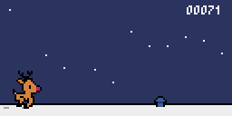

# Jour 23



## Défi

Créons un jeu de [Chrome Dino](https://en.wikipedia.org/wiki/Dinosaur_Game) avec Rudolf ! (3/4)

## Démarrer

**Troisième partie** 

En utilisant les techniques vues précédemment, coder :

+   l'apparition régulière d'obstacles (cheminées, antennes, bouches d'aération...)

+   la gestion des collisions

+   l'arrêt du jeu et la réinitialisation du score

## Une solution

🐍 [Voir le fichier](day23.py)

```py
import pyxel
from random import randint

pyxel.init(128, 64)
pyxel.load('../advent.pyxres')

score = 0
start = False
delay = 0

# Saut
jumping = False
jumpStep = 0

# Rudolf
rudolfY = 39
rudolfBounds = []
rudolfBounds.append([22, rudolfY + 9])
rudolfBounds.append([22, rudolfY + 10])
rudolfBounds.append([21, rudolfY + 11])
for i in range(7, 21) :
    rudolfBounds.append([i, rudolfY + 17])

# Etoiles
stars = []
for i in range(9, 127, 10) :
    stars.append([i, randint(1, 55)])

# Traces
footprints = [5]

# Obstacles
obstaclesTypes = ([72, 27, 9, 21], [81, 33, 8, 15], [89, 42, 7, 6])
obstacles = []
lastObstacle = 0

def frame_count() -> int :
    return pyxel.frame_count - delay

def update_bounds(bounds : list, dx : int, dy : int) -> None :
    for i in range(len(bounds)) :
        bounds[i][0] += dx
        bounds[i][1] += dy
    
def update() :
    global score, start, obstacles, stars, rudolfY, jumping, jumpStep, delay, lastObstacle, obstaclesTypes

    # Saut
    if frame_count() % 3 == 0 :
        if start and not jumping and pyxel.btn(pyxel.KEY_SPACE) :
            jumping = True
            jumpStep = -8
        if jumping :
            jumpStep += 1
            rudolfY += jumpStep
            update_bounds(rudolfBounds, 0, jumpStep)
        if jumpStep == 7 :
            jumping = False
            jumpStep = 0

    # Traces
    if start :
        if len(footprints) > 0 and footprints[0] == -4:
            footprints.pop(0)
        for i in range(len(footprints)) :
            footprints[i] -= 1

    # Score et traces
    if start and frame_count() % 10 == 0 :
        score += 1
        if not jumping :
            footprints.append(5)
    elif start and frame_count() % 10 == 5 and not jumping :
        footprints.append(15)

    # Démarrage
    if not start and pyxel.btn(pyxel.KEY_SPACE) :
        start = True
        delay = frame_count()
        score = 0

    # Etoiles
    if start :
        if stars[0][0] == 0:
            stars.pop(0)
            stars.append([127, randint(1, 55)])
        for i in range(len(stars)) :
            stars[i][0] -= 1

    # Obstacles
    if start :
        # Recul
        for i in range(len(obstacles)) :
            obstacles[i][0] -= 1
            update_bounds(obstacles[i][3], -1, 0)

        # Suppression
        if len(obstacles) > 0 and obstacles[0][0] + 9 < 0 :
            obstacles.pop(0) 

        # Collision
        for i in range(len(obstacles)) :
            if 5 < obstacles[i][0] <= 26 :
                for pixel in rudolfBounds :
                    # Game over
                    if pixel in obstacles[i][3] :
                        start = False
                        obstacles = []
                        lastObstacle = 0
                        return
            if obstacles[i][0] > 26 :
                break

        # Ajout
        if frame_count() % 9 == 0 :
            lastObstacle += 1
            if lastObstacle > 4 and randint(0, 3) == 0 :
                lastObstacle = 0
                type = randint(0, 2)
                h = obstaclesTypes[type][3]
                if type in [0, 1] :
                    h = randint(7, h)
                bounds = []
                for x in range(128, 128 + obstaclesTypes[type][2] - 2) : 
                    bounds.append([x, 59 - h])
                for y in range(59 - h, 57) : 
                    bounds.append([128, y])
                obstacles.append([128, h, type, bounds])

def draw() :
    global score, start, obstacles, rudolfY, obstaclesTypes
    pyxel.cls(1)
    
    # Sol
    pyxel.line(0, 57, 128, 57, 0)
    pyxel.rect(0, 58, 128, 6, 7)
    
    # Etoiles
    for [x, y] in stars :
        pyxel.pset(x, y, 7)

    # Traces
    for x in footprints :
        pyxel.line(x, 59, x + 2, 59, 13)

    # Obstacles
    if start :
        for [x, h, t, b] in obstacles : 
            pyxel.blt(x, 59 - h, 0, obstaclesTypes[t][0], obstaclesTypes[t][1], obstaclesTypes[t][2], h, 7)

    # Score
    pyxel.text(103, 3, str(score).rjust(5, "0"), 7)

    # Message de lancement
    if not start :
        pyxel.rect(10, 29, 105, 6, 1)
        pyxel.text(11, 30, "- Press [space] to start -", 7)
    
    # Rudolf
    if start :
        if frame_count() % 10 < 5 :
            pyxel.blt(5, rudolfY, 0, 32, 0, 21, 21, 10)
        else :
            pyxel.blt(5, rudolfY, 0, 48, 24, 21, 21, 10)
    else :
        pyxel.blt(5, 39, 0, 32, 0, 21, 21, 10)

pyxel.run(update, draw)
```